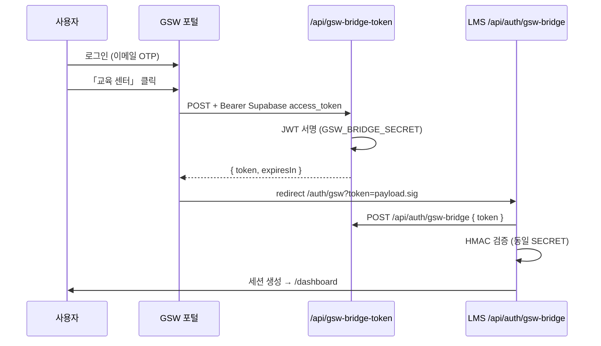

# GSW ↔ LMS 브릿지 연동 (1차)

포털(`evkmc-as-app`)에서 인증된 사용자만 LMS(`lms-youtube-testbed`)에 SSO 형태로 진입합니다.

## 흐름



## 토큰 형식 (LMS `src/lib/gsw-bridge.ts` 와 동일)

표준 JWT가 **아닙니다**. `payloadB64.signatureB64` 두 부분으로 구성합니다.

```text
token = base64url(JSON.stringify(payload)) + '.' + base64url(HMAC-SHA256(GSW_BRIDGE_SECRET, payloadB64))
```

| 필드 | 설명 |
|--------|------|
| `email` | 포털 사용자 이메일 |
| `gsw_user_id` | `public.users.profile_id` (없으면 `auth.users.id`) |
| `name` | 표시 이름 |
| `department` | (선택) `users.affiliation` |
| `exp` | Unix 초 (기본 **5분**, `GSW_BRIDGE_TOKEN_TTL_SEC`) |

LMS 로컬 프로젝트: `D:\LMS\lms-project` — [`docs/ROADMAP_GSW_UI.md`](../../../LMS/lms-project/docs/ROADMAP_GSW_UI.md) 참고

## Vercel 환경 변수

### GSW 포털 (`evkmc-as-app`)

| 변수 | 노출 | 설명 |
|------|------|------|
| `GSW_BRIDGE_SECRET` | 서버만 | LMS와 동일한 서명 키 (32자 이상 권장) |
| `GSW_LMS_BRIDGE_URL` | 서버 | LMS 수신 URL (데모 API redirect용) |
| `VITE_GSW_LMS_BRIDGE_URL` | 클라이언트 | 포털 redirect 대상 (기본: `…/auth/gsw`) |
| `SUPABASE_URL` | 서버 | (선택) 미설정 시 포털과 동일 기본 URL 사용 |
| `SUPABASE_ANON_KEY` | 서버 | (선택) 미설정 시 공개 anon 키 fallback — **권장: Vercel에 명시 등록** |
| `GSW_BRIDGE_SECRET` | 서버 | **권장** — LMS와 동일. 미설정 시 코드 내 공통 fallback 사용(양쪽 동일 문자열) |
| `GSW_BRIDGE_TOKEN_TTL_SEC` | 서버 | (선택) 기본 `300` |
| `GSW_BRIDGE_ALLOW_DEV` | 서버 | `true` 시 `/api/gsw-bridge-demo` 활성 |
| `VITE_GSW_BRIDGE_ALLOW_DEV` | 클라이언트 | 로그인 화면 「GSW 브릿지 데모」 버튼 |
| `GSW_BRIDGE_DEV_*` | 서버 | 데모 JWT용 email / user id / name / department |
| `VITE_GSW_BRIDGE_ONLY` | 클라이언트 | 포털 로그인에서 이메일 로그인 숨김 (LMS 전용 안내) |

### LMS (`lms-youtube-testbed`)

| 변수 | 설명 |
|------|------|
| `GSW_BRIDGE_SECRET` | 포털과 **동일** |
| `GSW_BRIDGE_ONLY` | `true` → LMS 로그인 화면에서 이메일 로그인 숨김, 포털 브릿지만 허용 |
| `GSW_BRIDGE_ALLOW_DEV` | `true` → LMS 로그인에 「GSW 브릿지 데모」 (포털 데모 URL 링크) |

## 포털 API

- `POST /api/gsw-bridge-token` — `Authorization: Bearer <supabase_access_token>`
- `GET /api/gsw-bridge-demo` — `GSW_BRIDGE_ALLOW_DEV=true` 일 때만, 테스트 JWT로 LMS redirect

## LMS 구현 (필수)

LMS(`D:\LMS\lms-project`)에는 이미 구현되어 있습니다:

- 수신 페이지: `GET /auth/gsw?token=...` → `POST /api/auth/gsw-bridge` 로 세션 생성
- 검증: `src/lib/gsw-bridge.ts`

포털은 위 HMAC 토큰 형식으로 `/auth/gsw` 로 redirect 하면 됩니다.

## 스모크 테스트

1. 포털·LMS Vercel에 `GSW_BRIDGE_SECRET` 동일 값 설정 후 재배포
2. 포털 로그인 → 「교육 센터」 → LMS `/dashboard` (또는 로그인 완료 화면)
3. (개발) `GSW_BRIDGE_ALLOW_DEV=true` → 로그인 화면 「GSW 브릿지 데모」 → LMS 수신 확인
4. 만료: 5분 후 동일 token 재사용 시 LMS에서 거부되는지 확인

## 관련 코드

- [`js/gswBridge.js`](../../js/gswBridge.js) — 클라이언트 redirect
- [`api/gsw-bridge-token.js`](../../api/gsw-bridge-token.js) — 토큰 발급
- [`api/lib/gswBridgeToken.js`](../../api/lib/gswBridgeToken.js) — 서명/검증 공통
